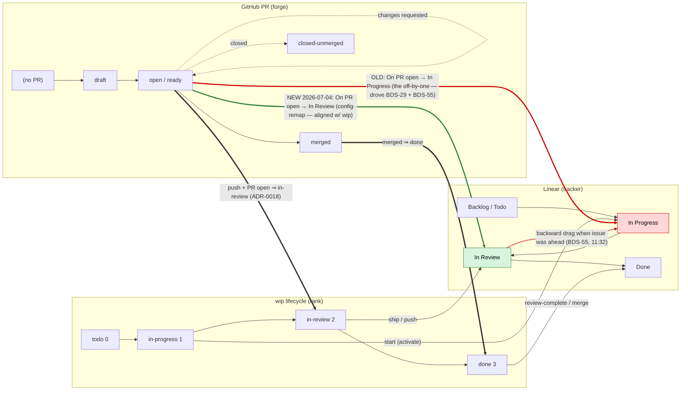

# Spike — aligning forge ↔ tracker ↔ wip state machines (BDS-59)

- Status: **spike COMPLETE (2026-07-04)** — deliverables met, recommendation firmed, confirmed end-to-end on BDS-29 (Todo → … → Done under the aligned config). Deeper modeling deferred to **BDS-62**. ADR amendments (0016/0018/0019) are follow-on (§9).
- Date started: 2026-07-04
- Initiative: `lifecycle-state-reconciliation` · Round 1 · Lane Spike · step-02 · `[tracker: BDS-59]`
- Sources: ADR-0018 (forge observation surface), ADR-0019 (wip⇄tracker lifecycle contract), ADR-0024 (node-level tracker granularity), BDS-55 incident, BDS-29 (the internal-actor sibling fix, now in PR #26)

> **How to read this doc.** It's a living artifact — you, me, and any agent we pull in edit it in place. Lines marked **⚠️ VERIFY** are claims that need checking against the *real* Linear workspace / GitHub settings before we rely on them; everything else is grounded in the cited ADRs/code.

---

## 1. The problem in one sentence

Three independent state machines govern one unit of work; wip enforces a strict **push-forward-only** discipline on its own transitions, but a **third actor it neither models nor controls — Linear's native GitHub PR automation — can move the tracker *backward*** (proven: BDS-55, a manual *In Review* flipped to *In Progress* on PR activity), so collisions are only discovered reactively.

BDS-29 (PR #26) fixed the *internal* backward mover (wip's own blind reconciler). **This spike is the external half.**

---

## 1b. CONFIRMED live — the automation, reproduced (2026-07-04)

Opening **PR #26** on branch `beau/bds-29-…` was a controlled specimen. Timestamps:

- PR #26 created: `2026-07-04T20:57:15Z`
- **BDS-29: Todo → In Progress at `2026-07-04T20:57:18Z`** (3 seconds later) **+ auto-assigned to the PR author.**
- wip/we never wrote BDS-29's tracker state this session — only opened the PR.

**Findings (no longer speculative):**

1. **The automation is enabled** for this workspace/team. (answers part of Q2)
2. **The rule: "PR opened on a linked branch" ⇒ set the issue to `In Progress`** (Linear's PR-mapped "started" state) + auto-assign. (answers Q1 for the PR-open event)
3. **The collision is an off-by-one mapping of the *same* forge event:**
   - wip / ADR-0018: `PR open` ⇒ **`in-review`** (rank 2)
   - Linear GH automation: `PR open` ⇒ **`In Progress`** (rank 1)
   When the issue is *behind* In Progress (e.g. Todo → BDS-29 now) the move is a harmless **forward**; when it is *ahead* (In Review → BDS-55 at 11:32) the identical rule is a **backward** drag. Same rule, valence depends on current rank. **This is the whole BDS-55 collision, reproduced.**
4. **BDS-29 is itself now a live misalignment:** its PR is open (= "in review" in wip's/ADR-0018's model) but Linear showed it **In Progress**. The systems disagreed about the same PR.

> **✅ Reconciliation RESOLVED — case (2).** The user confirmed they changed the dropdowns during the Q2 check. So at the time of the BDS-29 observation the rule was **`On PR open → In Progress`** (matching the observed move), and it has now been **remapped to `In Review`**. The off-by-one was real; the PR-open automation *was* the driver (no separate branch-automation needed to explain it), and the source-level fix (§6a) is now **applied** for this workspace: Linear's `On PR open` (In Review) and `On PR merge` (Done) agree with wip/ADR-0018. BDS-55's 11:32 flip is the same pre-fix mapping firing while the issue was ahead.

**Still to verify:** which *other* PR events fire (merge ⇒ ? ; ready-for-review ⇒ ? ; reopen/push ⇒ ?), and whether the mapping is **configurable/disable-able** per team/workflow (needs the Linear GitHub-integration settings UI). Watching PR #26 through **merge** gives us the `merged ⇒ ?` data point next.

### Experiment E1 — is auto-re-correct a tug-of-war? (2026-07-04)

Manually moved BDS-29 `In Progress → In Review` at `22:43:01Z` with **no new PR event**. Result: **it held** (no bounce). Finding: **the automation is event-driven** — it fires on PR events (open, and presumably push/ready/reopen/merge), not on state changes and not on a timer. Consequences for §7:

- A wip push-forward **re-correct will stick** (no instant re-flip) — so it's *viable*, not a doomed tug-of-war.
- But it is **not durable**: the next qualifying PR event re-drags a manually/wip-set In Review back to In Progress. Auto-re-correct is therefore a *reactive patch that must re-fire after each PR event*, not a fix. Durable fix = source-level (§6a) or an In-Review-resistant state (§6b, pending ⚠️ Q2).
- Caveat: watched only seconds; a delayed/batched flip is unlikely but not disproven. Definitive test = the next PR event (PR #26 merge).

---

## 2. The three state machines

### 2a. wip lifecycle (ADR-0019)

Semantic vocabulary, monotonic rank: `todo(0) < in-progress(1) < in-review(2) < done(3)` (+ `canceled`, passed through). Plumbing emits a provider-agnostic **intent** `{node, to, reason}`; it never calls the provider (ADR-0006). Boundaries that emit:

| Boundary | Intent | Tier |
|---|---|---|
| `workplan init --activate` | `{to: in-progress, reason: start}` | 0 |
| `wip ship` | `{to: in-review, reason: ship}` — or `transition: stood-down` under a forge | 0 |
| `wip review complete` | `{to: done, reason: review-complete}` | 0 |
| forge observes push + open PR | `{to: in-review, reason: push}` | 1 |
| forge observes PR merged | `{to: done, reason: merge}` | 1 |

**Discipline: push-forward only.** `wip sync` never moves the tracker backward and never writes tracker→wip truth. (The apply-side guard that enforces this on the default MCP path is BDS-29 / PR #26.)

### 2b. Forge — GitHub PR lifecycle (ADR-0018)

wip **observes** (via `gh`/`glab`), never owns the push. Observed state → intent:

| Observed forge state | wip intent |
|---|---|
| branch pushed **and** PR open | `in-review` |
| PR **merged** | `done` |
| PR closed-unmerged | none (signal only) |
| no push / no PR | none |

Underlying PR states: `(none) → draft → open/ready → [changes-requested] → merged | closed`.

### 2c. Tracker — Linear workflow states

`Backlog → Todo → In Progress → In Review → Done` (+ `Canceled`). wip's transport maps its semantic vocab → these names (`in-review` → "In Review", etc.).

**But three different actors can write Linear state:**

| Actor | Direction | Modeled by wip? |
|---|---|---|
| **Human** (manual, Linear UI/MCP) | any | n/a |
| **wip** (`sync` / MCP apply) | forward only (guarded, BDS-29) | yes |
| **Linear's native GitHub PR automation** | **any, incl. backward** | **NO — the unmodeled third actor** |

---

## 3. Unified alignment diagram

**Legend.** Black `W→T` edges = wip's push-forward writes (boundary or `sync`). Thick `F⇒W` edges = forge observation → wip intent (ADR-0018 §4). **Red** = the off-by-one that drove the collision: `On PR open → In Progress` (and the dotted `T2 ⇢ T1` backward drag when the issue was already ahead — BDS-55). **Green** = the fix: `On PR open` remapped to `In Review` (2026-07-04), lining Linear's *In Review* up with wip's `in-review` (rank 2). Node colors: **In Progress** red (the wrong target), **In Review** green (the aligned one).

---

## 4. The collision, concretely (BDS-55, 2026-07-03)

| # | Transition | Time | Actor |
|---|---|---|---|
| 1 | Backlog → In Progress | 05:24 | wip Round 1 start (manual via Linear MCP) |
| 2 | In Progress → In Review | 07:42 | human — all steps shipped, build verified |
| 3 | **In Review → In Progress** | **11:32** | **✅ Linear GitHub PR automation** — the pre-fix `On PR open → In Progress` mapping firing on PR activity while the issue was ahead (confirmed by the BDS-29 live reproduction + the settings capture, §1b/§5) |
| 4 | In Progress → In Review | 11:33 | human re-correction, ~59s later |

wip tooling is exonerated: `sync` is push-forward-only and no plumbing-side Linear write transport exists yet (BDS-23 deferred). Root cause confirmed: the (then) `On PR open → In Progress` automation forcing the issue to its PR-mapped "started" state.

---

## 5. Open questions to resolve (the spike's real work)

- **✅ Q1 (partial) — What does the automation do?** CONFIRMED (§1b): `PR opened` ⇒ `In Progress` + auto-assign, in ~3s. **Still open:** the `merged`, `ready-for-review`, and `reopen/push` events (which state each maps to). Watching PR #26 through merge closes the `merged ⇒ ?` gap.
- **✅ Q2 — Configurable? YES (settings captured 2026-07-04).** GitHub *Pull request automations* (workspace `beausimensen`) maps each PR event → a workflow status via a dropdown; options are **{No action, Todo, In Progress, In Review, Done}**. Current values: `draft PR open → In Progress`; `PR open → In Review`; `PR review request/activity → In Review`; `PR ready for merge → No action`; `PR merge → Done`. Plus per-target-branch overrides. So **disable (→ No action), remap (→ any status), and exempt-In-Review are all trivially available.** → §6(a) is a few dropdowns.
- **Q3 — Where should the mapping be configured?** (§6 options.)
- **Q4 — Should wip auto-re-correct a backward flip, or only detect + surface it?** (§7.)

**Live specimen available now:** PR #26 (BDS-29) was just opened on branch `beau/bds-29-…`, which Linear auto-links to BDS-29. Watching what Linear does to BDS-29's state on PR-open / merge is a *controlled* reproduction of the automation — cheaper than reconstructing BDS-55 after the fact.

---

## 6. Configurable-mapping options (to weigh — deliverable 3)

- **(a) Configure Linear's automation** — document/curate which Linear states auto-move on which PR events; possibly disable it or exempt "In Review". *Pro:* fixes it at the source, wip stays simple. *Con:* out-of-band manual Linear config, per-workspace, drifts silently, not enforceable by wip.
- **(b) wip-owned boundaries the automation must respect** — tell the automation to leave wip-managed states alone. *Pro:* explicit ownership. *Con:* depends on Linear supporting such scoping (see ⚠️ Q2); likely not fully possible.
- **(c) wip-side mapping + intentional reconciliation** — wip *models* that tracker states can move under it and reconciles deliberately instead of being surprised. *Pro:* wholly within wip's control; composes with BDS-29's guard. *Con:* wip is always one step behind a live external change.

**Recommendation (firmed).** Primary = **(a) align Linear's PR automations to wip's mapping** (`PR open → In Review`, `PR merge → Done`, `draft PR open → In Progress`) — trivially available per Q2, and **already applied to this workspace**. (b) folds into (a): "exempt In Review" = set any conflicting event to `No action`/`In Review`. **Plus (c) as the durable wip-side backstop** — because (a) is *out-of-band* (per-workspace, hand-maintained, invisible to wip, silently drifts, and absent in any new workspace/team): wip should **document the canonical mapping and detect drift** (a tracker rank sitting below wip's floor) via `doctor --probe-linear`, and surface it. Auto-re-correct (§7) stays optional/secondary now that the source is aligned.

---

## 7. Reconciliation-policy recommendation (deliverable 4 — DRAFT)

The muscle already exists from BDS-29: *"refuse, or push-forward re-correct, any move below the tracker's current rank."* BDS-29 applied it to wip's own emitter; here we apply it to an **externally-caused** backward move.

Proposed shape (to refine together):
1. **Detect** — extend `wip doctor --probe-linear`: read the issue's live tracker rank, compare to wip's cache floor; a tracker rank **below** the wip floor with no wip intent behind it = an external backward flip.
2. **Surface** — report it (a `tracker-regressed` signal), the way `doctor` surfaces other drift.
3. **Re-correct** — decision (Q4), now informed by E1: auto push-forward re-assert wip's truth **will stick** (E1 proved it's not an instant tug-of-war — the automation is event-driven), but it is **not durable** (the next PR event re-drags it). So auto-re-correct is a valid *reactive* layer, but the durable fix is source-level. Recommended shape: **surface always; auto-re-correct only in tandem with a source-level mitigation** (§6a/b) — otherwise wip re-corrects and the next push silently undoes it, which is worse than a visible drift signal a human acts on.

*Ties back to §6(c): the reconciliation policy IS the wip-side mapping made operational.*

---

## 8. Acceptance (from BDS-59)

- [x] Documented forge↔tracker↔wip state-alignment diagram (§3)
- [x] Linear GitHub automation characterized precisely (§5 Q1/Q2) — rule + configurability confirmed against the live workspace; `PR open → In Progress` (pre-fix) / merge → Done verified on BDS-29
- [x] Recommendation on making the mapping configurable (§6) — align source config (applied) + wip-side drift detection
- [x] Recommendation on whether/how wip auto-re-corrects a backward flip (§7) — surface always; auto-re-correct only with a source mitigation (E1: viable but not durable)

---

## 9. ADR impact — what this spike will amend

The diagram's **black edges are transcribed from ADR-0018/0019**; the **red edges (Linear's GH automation) are empirical and modeled by no ADR**. That gap is the amendment driver.

- **ADR-0018 §4 (observed state → intent).** Documents wip's mapping `PR open ⇒ in-review`; silent on Linear's automation mapping the same event `⇒ In Progress`. **Amend:** name the third actor; document the off-by-one; state which mapping is authoritative and how the other is reconciled/configured.
- **ADR-0018 §5 (stand-down contract).** Its guarantee — *"exactly one transition writer at a time, so Tier-0 and Tier-1 never both fire"* — is **false in practice**: Linear's GH automation is a second, uncontrolled writer that fires regardless of wip's stand-down. **Amend:** the single-writer guarantee covers only *wip-controlled* writers; an external forge-integration automation is a third writer that must be modeled + reconciled, not assumed absent.
- **ADR-0019 (push-forward-only; "no tracker→wip truth writes").** Keeps *wip* from moving backward; says nothing about the tracker being moved backward *by someone else*. **Amend/extend:** push-forward-only now also entails *detecting and re-asserting* against externally-caused backward moves (§7) — the BDS-29 `min_rank` muscle pointed at an external actor.
- **New ADR (this spike's output).** The forge↔tracker↔wip alignment + configurable mapping (§6) + reconciliation policy (§7). Graduates from this doc; amends/supersedes the points above. Number TBD — verify against `engineering/decisions/` + in-flight branches before claiming one.

Sequencing note: the ADR amendments are a **follow-on to the spike's recommendation**, not part of the spike itself — they land once §6/§7 settle and, per §10, after **BDS-62** revises the model/vocabulary (so the ADRs are amended once, coherently). (This is also a plausible re-entry point for orchestration: the amendments + any `doctor --probe-linear` reconciliation implementation are concrete, ADR-shaped/code-shaped work.)

---

## 10. Deferred to BDS-62 (intentional follow-on spike)

Two deeper modeling threads surfaced here but sit below BDS-59's charter — filed as **BDS-62** (blocked by BDS-59; blocks BDS-27):

1. **Arrows into the forge.** Model the actors/events that *drive* forge transitions (human / BDS-27 policy → push / open / merge). The absence of inbound forge edges in §3 is faithful to ADR-0018 (wip observes, doesn't drive), but leaves the drivers unmodeled.
2. **wip lifecycle vocabulary.** `ship` is overloaded (closeout marker + `in-review` trigger; stands down under a forge); "push" ≠ "ship" and doesn't always imply *in-review*; "ship" connotes accepted/done. Re-examine the verbs/boundaries.

BDS-62 feeds its results back into this diagram and the §9 ADR amendments — which is why those amendments wait for it.
</content>
